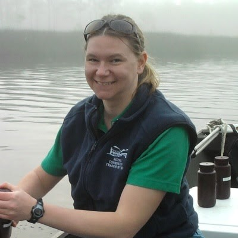

```{r setup, include=FALSE}
htmltools::tagList(rmarkdown::html_dependency_font_awesome())
```

<div class="jumbotron">
<p>This is an [R Markdown website](http://rmarkdown.rstudio.com/rmarkdown_websites.html). 
The source can be found on [GitHub <i class="fa fa-github"></i>](https://github.com/skdunnigan/2020-06_GTMNERR_RWorkshop).</p>
<p>
The link to all the workshop content can be found here: [<button type="button" class="btn btn-info">Workshop Materials</button>](https://github.com/skdunnigan)</p>
</div>


# Who are we?

```{r shannonimage, fig.height = 1, fig.width = 1, echo = FALSE}


```

#### Shannon Dunnigan, Guana Tolomato Matanzas NERR

[<i class="fa fa-envelope"></i> Shannon.Dunnigan@FloridaDEP.gov](Shannon.Dunnigan@FloridaDEP.gov)  |  [<i class="fa fa-github"></i>  skdunnigan](https://www.github.com/skdunnigan)

*Shannon Dunnigan is the System-Wide Monitoring Program (SWMP) Manager at the Guana Tolomato Matanzas National Estuarine Research Reserve and has been an instructor at the University of North Florida for over five years. She has a love for large data sets and has been using R on monitoring data for the last 3 years; primarily for data wrangling, export, and the creation of data visualizations.*


<br>

```{r kimimage, fig.height = 1, fig.width = 1, echo = FALSE}


```

#### Kim Cressman, Grand Bay NERR

[<i class="fa fa-envelope"></i> Kimberly.Cressman@dmr.ms.gov](Kimberly.Cressman@dmr.ms.gov)  |  [<i class="fa fa-github"></i> swmpkim](https://www.github.com/swmpkim)

*Kim Cressman is the System-Wide Monitoring Program Coordinator at Grand Bay National Estuarine Research Reserve (NERR). She has been using R on monitoring data for over five years, and has been active in incorporating R into NERR system-wide efforts, such as developing tools to work with surface elevation table data; advising the development of Status Report templates for monitoring data; contributing to NERR-data-related R packages; posting educational “Plot of the Month” posts on SWMPrats.net; and leading R workshops for NERR staff and collaborators.*

***

# Previous workshops:

  * *The Next Step with R: Data Management, Graphics, and Functions* at the Coastal and Estuarine Research Federation (CERF) in Mobile, AL in November 2019. Materials can be found [here](https://github.com/swmpkim/2019_CERF)
  * *Integrating R into your work with RStudio and the tidyverse* at Grand Bay NERR in Grand Bay, MS in February 2020. Materials can be found [here](https://github.com/swmpkim/2020-02_GBNERR_Rworkshop)

